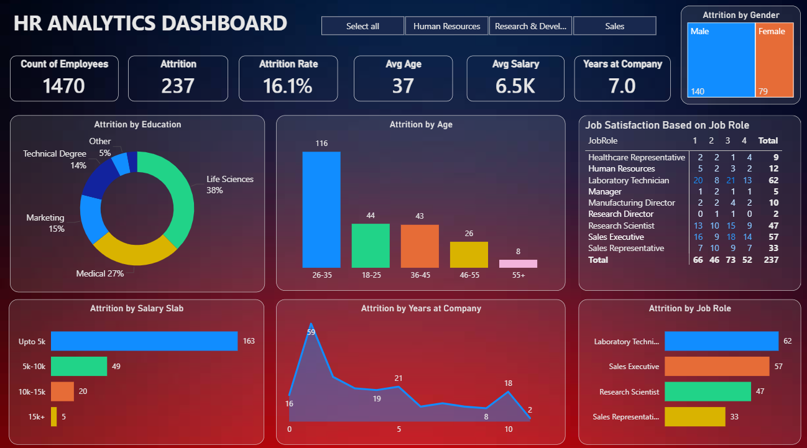

# HR Analytics Dashboard (Power BI)

## Project Overview
This project analyzes employee data using Power BI to understand attrition trends, workforce demographics, and job-related factors. The dashboard is created for learning and practical data analytics experience.

## Objective
- Analyze employee attrition
- Understand age group and department trends
- Study job satisfaction and work-life balance
- Build an interactive HR dashboard

## Tools Used
- Power BI
- Power Query
- DAX
- Microsoft Excel (for CSV data)

## Dataset
The dataset includes:
- Employee details (Age, Gender, Department)
- Job information (Job Role, Job Level, Income)
- Attrition and performance metrics
- Work-life balance and experience data

Dataset file:
- HR_Analytics_Data.csv

## Dashboard Features
- Attrition analysis
- Age group distribution
- Department-wise insights
- Income and job satisfaction analysis
- Interactive filters and visuals

## Dashboard Preview

## Note
This project is created for learning and skill demonstration purposes using publicly available HR analytics data.

